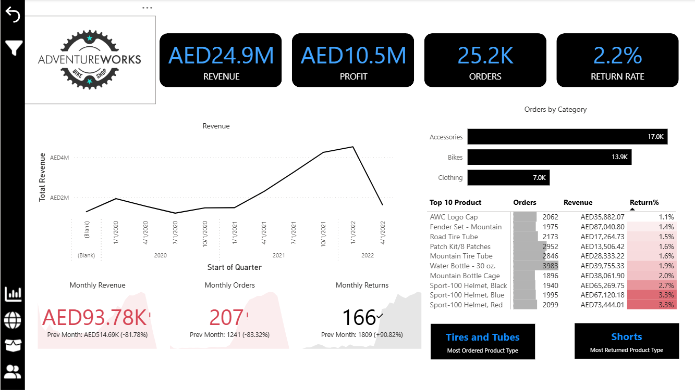
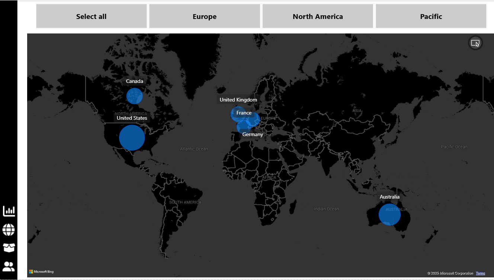
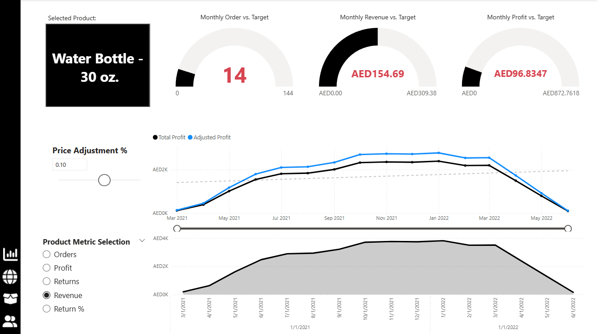
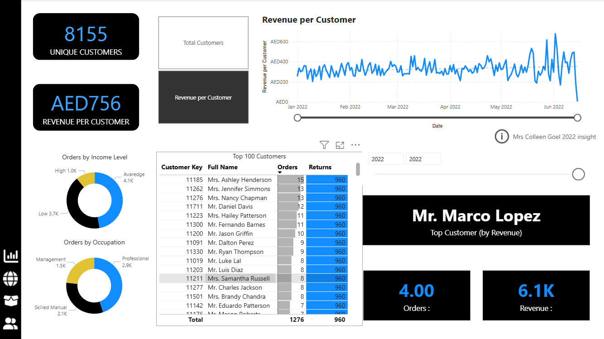

# 🚴 AdventureWorks Analysis Dashboard

## 📌 Project Overview
This project is part of a Business Intelligence course, where I worked as a **Business Intelligence Analyst** for **AdventureWorks**, a global manufacturing company producing cycling equipment and accessories.  

The goal was to transform a set of **raw CSV files** into a fully interactive **Power BI dashboard** to help management track performance and identify business opportunities.

**Note** this was a part of Power Bi course where i practice with it 
---

## 🎯 Project Brief
The management team needed a way to:
- Track **KPIs**: sales, revenue, profit, and returns
- Compare **regional performance**
- Analyze **product-level trends**
- Identify **high-value customers**

The only data provided was a **folder of raw CSV files** containing:
- Products
- Customers
- Returns
- Sales territories
- Calendar
- Product Subcategories
- Sales 2020 - 2022
---

## 🛠 Tools & Technologies
- **Power BI Desktop**
- **DAX** (Data Analysis Expressions)
- **Power Query**
- Relational Data Modeling

---

## 📂 Steps & Methodology
1. **Data Connection & Transformation**  
   - Imported multiple CSV files into Power BI  
   - Cleaned and shaped the data using Power Query  

2. **Data Modeling**  
   - Built a relational data model with star schema  
   - Created relationships between fact and dimension tables  

3. **Calculations**  
   - Developed calculated columns and measures using DAX  
   - Created KPIs for sales, revenue, profit, and returns  

4. **Dashboard Design**  
   - Built an interactive report with filters and slicers  
   - Visualized KPIs, trends, and geographic performance  

---

## 📊 Dashboard Features
- **KPI Cards**: Revenue, Profit, Orders, Return Rate  
- **Regional Performance Map**  
- **Top Products by Revenue**  
- **Trend Analysis Over Time**  
- **Customer Segmentation by Value**

---

## 📸 Screenshots 
  
  
  
  

---

## 📂 How to View the Project
1. Download the `.pbix` file from this repository  
2. Open it using **[Power BI Desktop](https://powerbi.microsoft.com/desktop/)** (Free)  

---

## 🧠 Key Learnings
- Data cleaning and transformation in **Power Query**
- Building a **relational data model**
- Writing **DAX** measures for KPIs
- Designing effective **data visualizations** in Power BI

---

## 📌 Data Source
This dataset is provided by Microsoft Power Bi course on Udemy.

---

**Author:** *Mohammad Jameel Abdelqader*  
**Date:** *August 2025*
